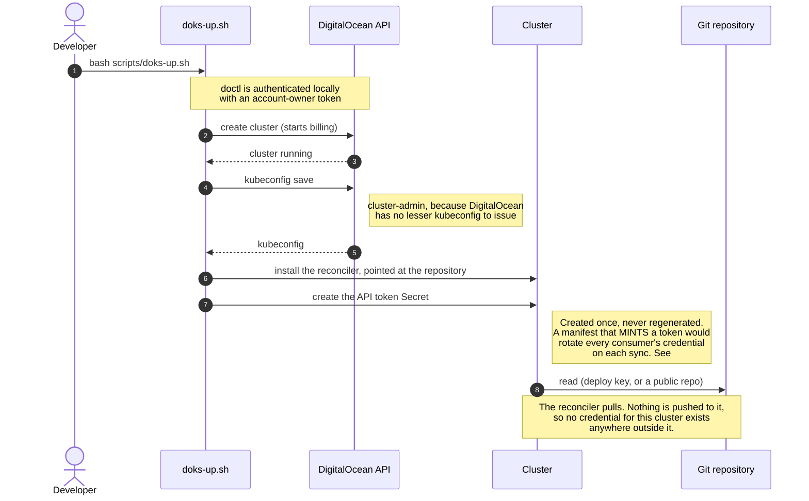
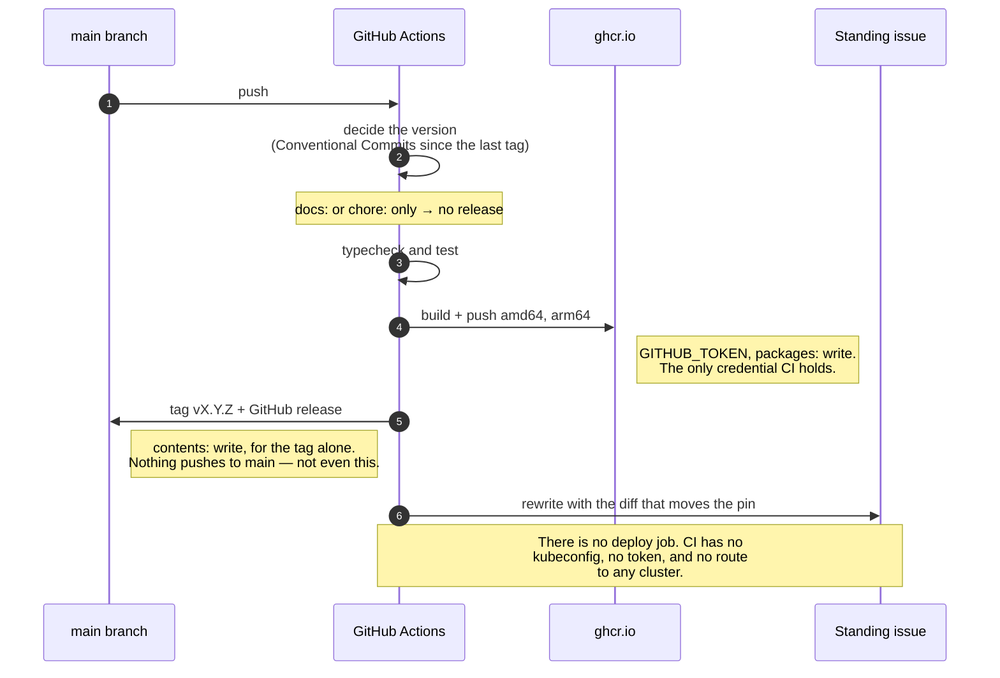
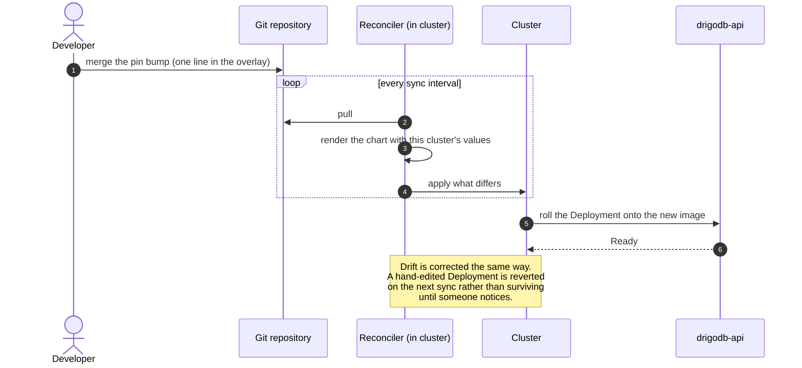
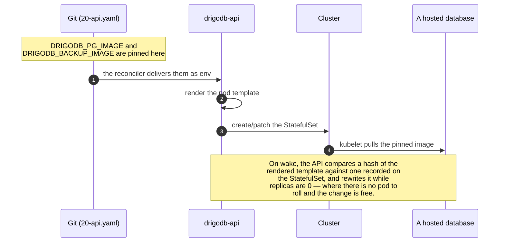

# How a merge should reach a cluster

**This is the target, not what runs today.** Today CI pushes to the cluster with a ServiceAccount
token; [decision 0002](../decisions/0002-gitops-for-the-control-plane.md) chose pull-based
reconciliation instead, and issues #48–#51 are the distance between the two. The transition table at
the end says which piece moves when.

**"Reconciler" throughout means a Kubernetes controller — Flux or Argo CD — running inside the cluster,
pulling desired state from this repository and applying it.** The OpenGitOps principles call it a
"software agent", which was unambiguous when they were written and is not any more.

The shape it is aiming at: **CI never touches the cluster.** It publishes an image and says so. A
reconciler inside the cluster converges on what Git declares. The only credential that ever leaves a
laptop is one that can write to GHCR.

## 1. Bootstrap — `scripts/doks-up.sh`, run by a human

Every strong credential is used here, once per cluster, and none of it leaves the machine.

No ServiceAccount minted for CI, no repository secrets pushed, and nothing to go stale when the cluster
is deleted.

## 2. Release — `.github/workflows/release.yml`, on every merge to `main`

The release ends at "published, and here is the one-line change that would ship it". It cannot deploy
what it just built, because the commit being released does not yet name the image it is about to
produce. That is the cost 0002 accepts: **publishing and promoting are two merges.**

## 3. Promotion and reconciliation

A local `kind` cluster reconciling the same repository runs **this same loop with the same controller**
(#52). That is what makes "test locally as it would behave remotely" true rather than approximate —
today it means running `deploy.sh` by hand and trusting it matches CI.

## 4. How a database gets its image — unchanged

Worth showing because it is the part that is already reconciled, and it does not change.

The data plane is **not** reconciled from Git and cannot be: a hosted database is created at runtime by
a customer's API call, and representing it in Git would mean a commit per signup. So there are two
reconcilers — the reconciler converging the control plane on Git, and the control plane converging databases
on its own compiled-in template. 0002 explains why that is coherent rather than inconsistent.

## Which credential does what

| Credential | Held by | Reaches | Used for |
|---|---|---|---|
| DigitalOcean personal token | the laptop, via `doctl auth` | the whole account | creating and deleting the cluster |
| DO-issued kubeconfig | the laptop, transiently | cluster-admin | installing the reconciler |
| `GITHUB_TOKEN` | GitHub Actions | GHCR packages, the repo's tags | publishing images, tagging |
| the reconciler's repository read | inside the cluster | one repository, read-only | pulling desired state |

**Nothing outside the cluster can write to the cluster.** That is the whole point, and it is the third
step in the same direction: an account-owner kubeconfig became a two-namespace ServiceAccount token in
#45, and becomes no external credential at all here.

## The transition

| Moves | Issue |
|---|---|
| API image pinned in Git, not resolved from the newest tag at apply time | [#48](https://github.com/drigolabs/drigodb/issues/48) |
| `deploy.sh`'s `sed`, generated token and `--dry-run \| apply` become a Helm chart | [#49](https://github.com/drigolabs/drigodb/issues/49) |
| Flux or Argo CD chosen, measured on a real node | [#50](https://github.com/drigolabs/drigodb/issues/50) |
| Reconciler installed by `doks-up.sh`; deploy job and its three secrets deleted | [#51](https://github.com/drigolabs/drigodb/issues/51) |
| A local cluster runs the same loop | [#52](https://github.com/drigolabs/drigodb/issues/52) |

Until #51, the flow that actually runs is a push from CI holding
`DRIGODB_DEPLOY_TOKEN` — a ServiceAccount scoped to two namespaces, created by `doks-up.sh` and
described in `deploy/05-deployer-rbac.yaml`.
