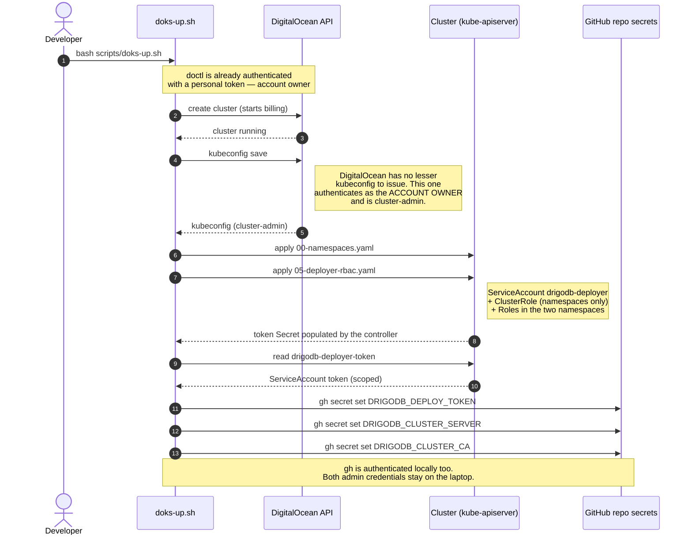
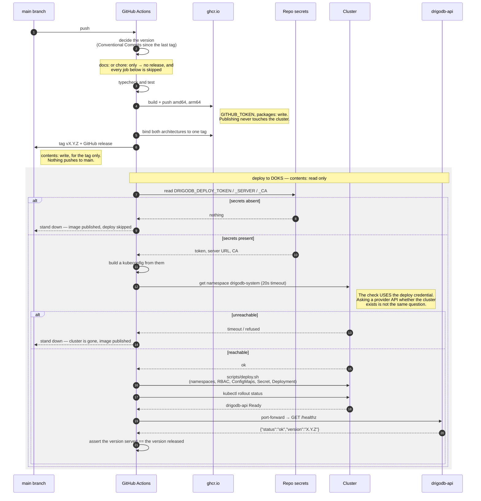
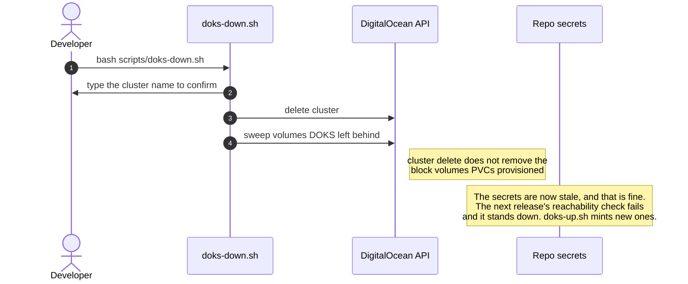

# How a merge reaches a cluster

Three separate flows, and the interesting part is which credential each one holds.

The short version: **the privileged step happens on a laptop, once per cluster. CI holds a credential
that can deploy drigodb and nothing else, and never talks to DigitalOcean at all.**

## 1. Bootstrap — `scripts/doks-up.sh`, run by a human

This is where every strong credential is used, and where the weak one CI gets is minted.

The cluster-admin kubeconfig never leaves the machine. Neither does the DigitalOcean token. What
reaches GitHub is a ServiceAccount token that cannot delete nodes, cannot read Secrets in
`kube-system`, and cannot create ClusterRoleBindings.

## 2. Release — `.github/workflows/release.yml`, on every merge to `main`

The two stand-down branches are the normal state of the world, not failures: the cluster is torn down
between sessions because DOKS bills whether or not anyone is connected. A merge with no cluster
running publishes the image and says so.

## 3. Teardown — `scripts/doks-down.sh`

## Which credential does what

| Credential | Held by | Reaches | Used for |
|---|---|---|---|
| DigitalOcean personal token | the laptop, via `doctl auth` | the whole DO account | creating and deleting the cluster |
| DO-issued kubeconfig | the laptop, transiently | cluster-admin — nodes, every Secret | bootstrapping the deployer |
| `gh` auth | the laptop | the repository | writing the three secrets |
| **`DRIGODB_DEPLOY_TOKEN`** | **GitHub Actions** | **two namespaces, no nodes, no `kube-system`** | **deploying** |
| `GITHUB_TOKEN` | GitHub Actions | GHCR packages, the repo's tags | publishing images, tagging |

Everything above the bold row stays local. The only long-lived credential outside the laptop is the
one that can deploy drigodb and nothing else.

## Why it is shaped this way

The pipeline used to hold a DigitalOcean token and exchange it for a kubeconfig on every deploy. That
kubeconfig is cluster-admin, because DigitalOcean has no other kind — so asking for one *is* asking for
cluster-admin, and a leaked repository secret reached the whole account rather than one deployment.

Moving the mint to `doks-up.sh` costs nothing, because that script already runs as an administrator:
creating a cluster requires one. The privileged step was always there. It just also used to happen in
CI, on every release, forever.

**The reachability check is the other half.** It used to ask DigitalOcean whether the cluster existed —
something a read-scoped token can do — so it passed while the very next call failed `403`, and seven
consecutive releases reported a successful deploy without ever deploying. A check that does not
exercise the credential it is checking is not a check. See
[#15](https://github.com/drigolabs/drigodb/issues/15).

## The credential dies with the cluster

Deliberately. `doks-down.sh` deletes the cluster and the ServiceAccount with it, leaving three secrets
that authenticate to nothing. That is the desired end state: a credential which outlives the thing it
grants access to is a credential nobody remembers to revoke.
