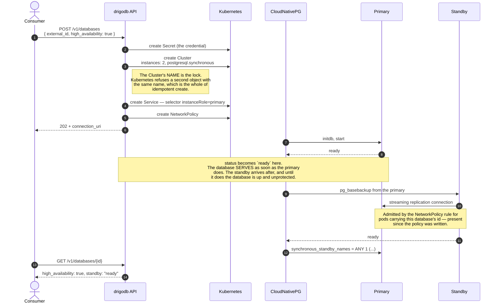
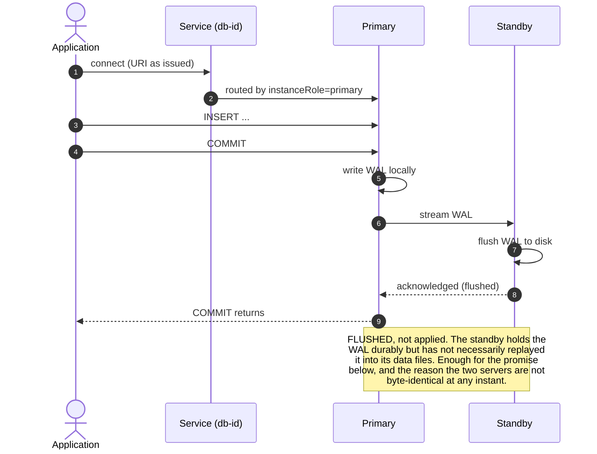
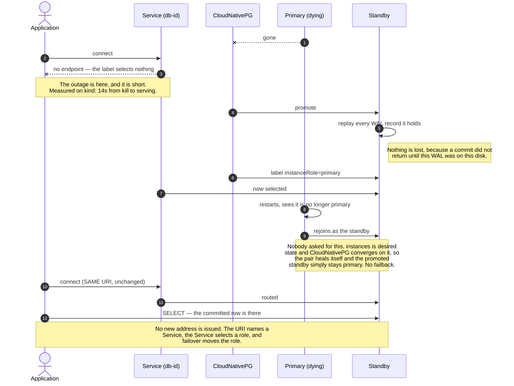
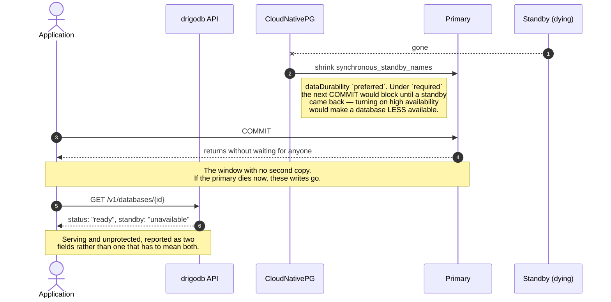

# A database with a standby

**Opt-in, per database, at create only.** A database asked for with
`high_availability: true` gets a second instance, commits wait for it, and the
loss of the primary does not change the address the consumer stored.

[Decision 0004](../decisions/0004-cloudnativepg-for-the-data-plane.md) chose
opt-in; [0001](../decisions/0001-instance-per-database-over-a-shared-cluster.md)
is why it matters — a standby doubles a database's pods and volumes, and nodes
run out of both.

Two things carry the whole design and neither is new. **drigodb's Service selects
the primary by label** rather than naming a pod, and **the NetworkPolicy has
always admitted instance-to-instance traffic**. Both were written that way before
there was anything to fail over, with comments saying so.

## 1. Creating one

`standby` is counted from ready instance pods, not from `status.readyInstances`,
which CloudNativePG does not zero on hibernation.

## 2. A commit, once both are up

`synchronous_commit` is left at PostgreSQL's default `on`, which is what "flushed,
not applied" means. `remote_apply` would close the gap and cost a replay round
trip on every commit; it buys nothing while nothing reads a standby.

## 3. The primary dies

## 4. When the standby is the one that dies

## What each state is called

| `status` | `high_availability` | `standby` | What is true |
|---|---|---|---|
| `provisioning` | `true` | absent | no instance ready yet |
| `ready` | `true` | `unavailable` | serving on one instance; commits are not waiting for anyone |
| `ready` | `true` | `ready` | serving, and every commit is on two disks |
| `hibernated` | `true` | absent | switched off on purpose — not a fault, and deliberately not reported as one |
| `ready` | `false` | absent | one instance, and that is what was asked for |

## What this does not give you

- **Zero downtime.** Failover is fast, not instant, and in-flight connections are
  dropped. A client that does not reconnect sees an error — what survives is the
  address and the data, not the socket. Anything with a pool and retries rides
  through it.
- **Anything for the caller to do afterwards.** That is not a gap, it is the
  point: a failed instance is replaced by CloudNativePG rather than by whoever
  noticed. `standby: "unavailable"` is information, not a task.
- **A read replica.** The endpoint selects the primary, so the standby serves no
  traffic. It is redundancy, not capacity.
- **Durability while degraded.** Section 4 is the hole, and it is deliberate:
  the alternative refuses writes whenever one pod is missing.
- **Turning it on later.** A repeat create returns the existing database and does
  not act on the flag. Adding a standby to a live database is a different
  operation with its own failure modes and is not built.
