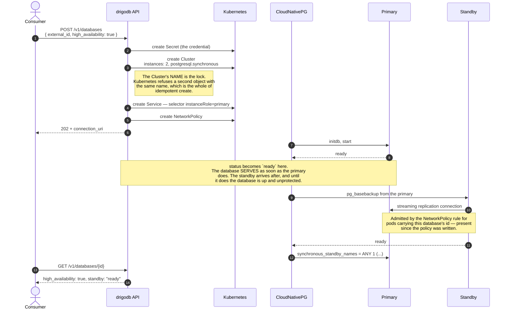
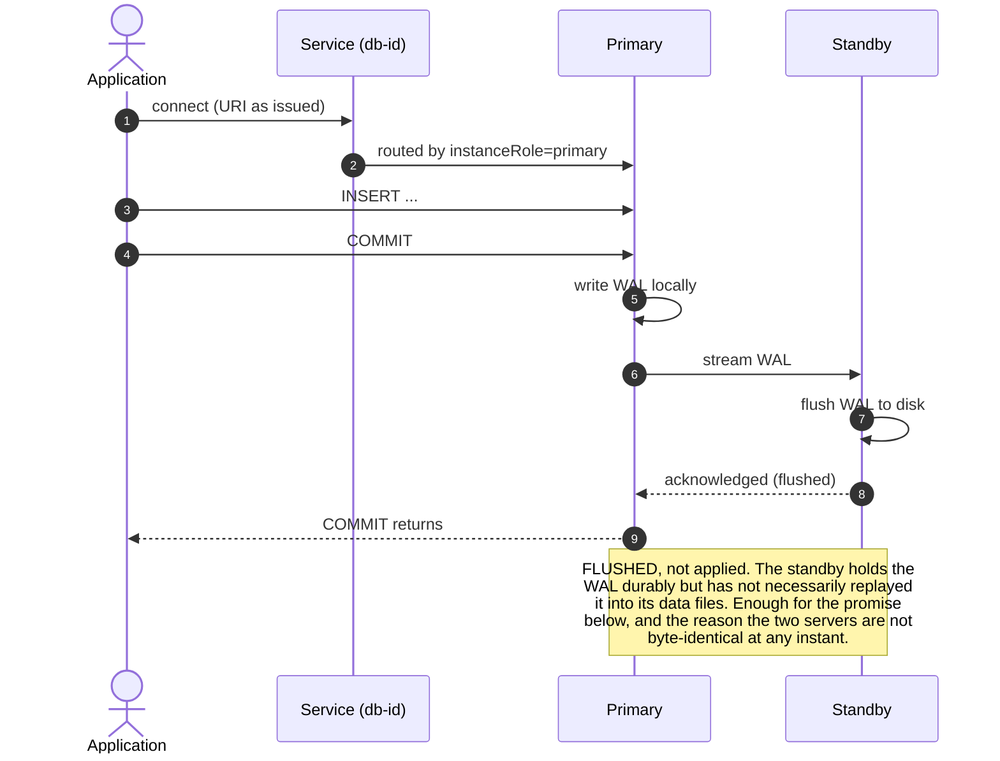
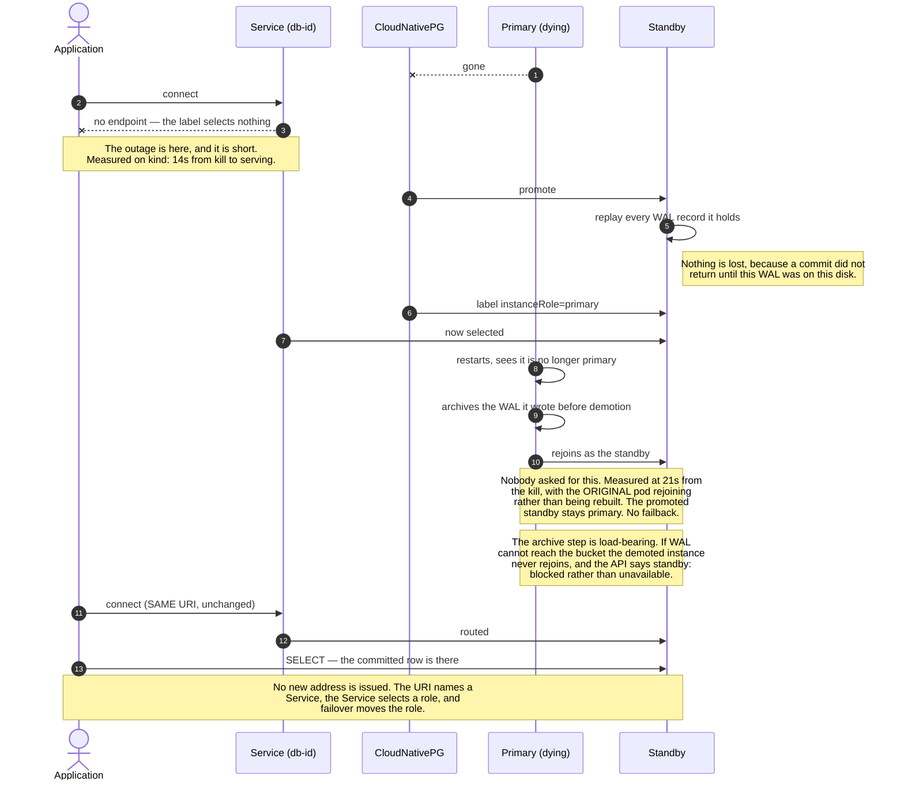
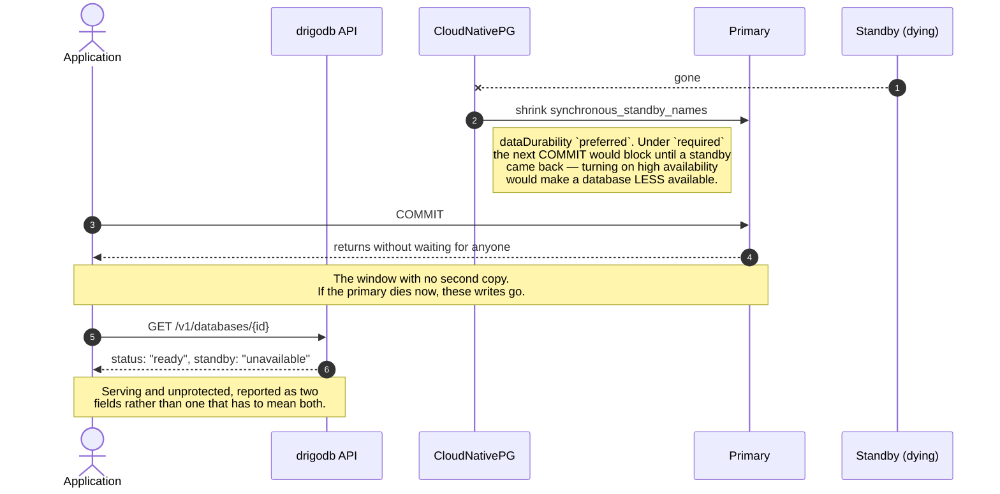

# A database with a standby

**Opt-in, per database, at create only.** A database asked for with
`high_availability: true` gets a second instance, commits wait for it, and the
loss of the primary does not change the address the consumer stored.

[Decision 0004](../decisions/0004-cloudnativepg-for-the-data-plane.md) chose
opt-in; [0001](../decisions/0001-instance-per-database-over-a-shared-cluster.md)
is why it matters — a standby doubles a database's pods and volumes, and nodes
run out of both.

Two things carry the whole design and neither is new. **drigodb's Service selects
the primary by label** rather than naming a pod, and **the NetworkPolicy has
always admitted instance-to-instance traffic**. Both were written that way before
there was anything to fail over, with comments saying so.

## 1. Creating one



`standby` is counted from ready instance pods, not from `status.readyInstances`,
which CloudNativePG does not zero on hibernation.

## 2. A commit, once both are up



`synchronous_commit` is left at PostgreSQL's default `on`, which is what "flushed,
not applied" means. `remote_apply` would close the gap and cost a replay round
trip on every commit; it buys nothing while nothing reads a standby.

## 3. The primary dies



## 4. When the standby is the one that dies



## What each state is called

| `status` | `high_availability` | `standby` | What is true |
|---|---|---|---|
| `provisioning` | `true` | absent | no instance ready yet |
| `ready` | `true` | `unavailable` | serving on one instance, standby being rebuilt — back on its own in ~21s |
| `ready` | `true` | `blocked` | serving on one instance and it will STAY that way: the demoted instance cannot archive its WAL, so it cannot rejoin. `archiving: "failing"` says why |
| `ready` | `true` | `ready` | serving, and every commit is on two disks |
| `hibernated` | `true` | absent | switched off on purpose — not a fault, and deliberately not reported as one |
| `ready` | `false` | absent | one instance, and that is what was asked for |

## What this does not give you

- **Zero downtime.** Failover is fast, not instant, and in-flight connections are
  dropped. A client that does not reconnect sees an error — what survives is the
  address and the data, not the socket. Anything with a pool and retries rides
  through it.
- **Anything for the caller to do afterwards.** That is not a gap, it is the
  point: a failed instance is replaced by CloudNativePG rather than by whoever
  noticed. `standby: "unavailable"` is information, not a task.
- **A read replica.** The endpoint selects the primary, so the standby serves no
  traffic. It is redundancy, not capacity.
- **Durability while degraded.** Section 4 is the hole, and it is deliberate:
  the alternative refuses writes whenever one pod is missing.
- **Turning it on later.** A repeat create returns the existing database and does
  not act on the flag. Adding a standby to a live database is a different
  operation with its own failure modes and is not built.

## The API, and what a failover costs a client

Moved here from the README, which is where this was written first — the drawings above and
the prose below describe one feature and were in two places.

```
POST /v1/databases  { external_id, high_availability: true }
```

Opt-in, per database, at create only. A database gets a standby, and a primary
failure promotes it **without the stored URI changing** — the endpoint drigodb
issues selects the primary by label, so a failover moves it rather than issuing
a new address.

**A failover is not transparent to the client.** While it happens the endpoint
selects no pod, so in-flight connections are dropped and new ones are refused
until the standby is promoted — measured at 14 seconds on kind. **A client that
does not reconnect sees an error.** Anything with a connection pool and retries
rides through it; anything that treats one failed connection as fatal does not.
What is guaranteed is the address and the data, not the socket.

**Nothing needs to be done afterwards — as long as WAL archiving works.** A
failed instance is recreated by CloudNativePG, not by the caller: `instances: 2`
is desired state and the operator converges on it. The old primary restarts,
notices it is no longer the primary and rejoins as the standby. Measured on
DigitalOcean: 9 seconds to serve again on the same URI, and **21 seconds to be
protected again**, with the original pod rejoining rather than being rebuilt.
The promoted standby stays primary; there is no failback, and no reason to want
one.

**The condition on that sentence is real, and the API reports it.** A demoted
primary holds WAL it wrote before demotion and must archive it before it can
rejoin. If archiving is failing — a wrong key, a deleted bucket, a changed
policy — it never rejoins, and the database sits on one instance reporting
`ready` indefinitely. That is why a missing standby has two values rather than
one:

```
standby: "unavailable"    it is being rebuilt; wait
standby: "blocked"        it cannot come back without you
archiving: "failing"      why
```

`unavailable` is information. **`blocked` is a task**, and the thing to fix is
the object storage, not the database.

`GET /v1/databases/{id}` reports two things, because they answer different
questions:

```
high_availability: true       what was asked for
standby: "ready"              what is true this second
archiving: "healthy"          whether WAL is reaching the bucket
```

`standby` has four values, because a missing standby is four situations and only
two of them are anything to act on:

```
"ready"          it is there
"provisioning"   being cloned right now — wait
"unavailable"    it existed, it is gone, and it is coming back on its own (~21s)
"blocked"        it cannot come back; `archiving` says why
```

`archiving` is reported for any database when the installation has somewhere to
back up to, not only a highly available one. It is separate from `backups`,
which says a destination is *configured* — an installation can be configured and
failing every write, and nothing used to say so.

A database with `standby: "unavailable"` is serving and unprotected, which is
the state worth being able to see. A hibernated database reports no `standby` at
all rather than an unhealthy one.

**Commits wait for the standby**, so a failover cannot promote a replica missing
writes the application was told had committed — silent data loss is worse than
the downtime this is bought to avoid. The guarantee relaxes to asynchronous when
no healthy standby exists, rather than blocking writes: `required` durability
would mean a database stops accepting writes the moment its only standby is
drained or rolled, which would make turning this on *reduce* availability. The
cost of that choice, stated plainly: if the standby is already gone and then the
primary dies, writes accepted in that window can be lost.

**Waiting means flushed, not applied.** A commit returns once the standby has
written that WAL to its own disk; the standby has not necessarily replayed it
into its data files yet. That is what makes the failover guarantee hold — a
promoted standby replays what it holds, so no acknowledged write is lost — while
leaving the two servers not byte-identical at any given instant. Nothing reads
the standby today, because the endpoint drigodb issues selects the primary, so
this is invisible until read replicas exist. When they do, a read served by a
standby can miss a row its own primary has already acknowledged, and closing
that gap means `synchronous_commit = remote_apply` and paying a replay round
trip on every commit.

[docs/diagrams/high-availability.md](../diagrams/high-availability.md) draws
all of this step by step: creating one, what a commit actually waits for, what
happens when the primary dies, and what happens when the standby is the one that
dies.

**It can be turned on later, and off again.**

```
POST /v1/databases/{id}/high-availability  { "enabled": true }
```

The decision to want high availability usually arrives *after* the database does.
CloudNativePG clones the standby with `pg_basebackup` from the **live** primary,
so this costs a sustained read against a serving database and takes as long as a
base backup of it. Poll `standby`: it reads `provisioning` for the duration.

`{"enabled": false}` removes it again. That destroys only the standby's volume —
the primary holds everything — so nothing is lost, and it also unwinds the
synchronous posture rather than leaving the primary waiting on a standby that no
longer exists.

Asking twice while a clone is running does nothing the second time.

**It costs what it sounds like.** A standby doubles a database's pods and
volumes. ADR 0001 measured a 1500 MiB node fitting three databases, and
DigitalOcean caps a node at 15 attached volumes — turning this on roughly halves
how many databases a node holds, which is why it is not the default.

**drigodb never touches object storage.** It names a Secret, and CloudNativePG's
barman-cloud plugin does the reading, the archiving and the writing. The control
plane holds no bucket credential and has no S3 client — which is a smaller blast
radius than the sidecar era managed with 250 lines of its own request signing.

A backup is a Kubernetes object, so `GET` answers for a **hibernated** database
too. That is exactly when someone asks what they can restore, and exactly when
there is no pod to ask; the previous implementation listed the bucket and could
not answer it at all.

**Requires the barman-cloud plugin, which requires cert-manager.**
`scripts/cnpg-install.sh` installs both, pinned. Turning backups on therefore
costs an installation two cluster-scoped components it may not have wanted —
stated here rather than discovered.

The plugin, not `spec.backup.barmanObjectStore`. That works on the pinned
CloudNativePG 1.27 and is **removed in 1.28**, a deprecation nothing in the CRD
schema mentions and only the admission webhook prints, on apply.
