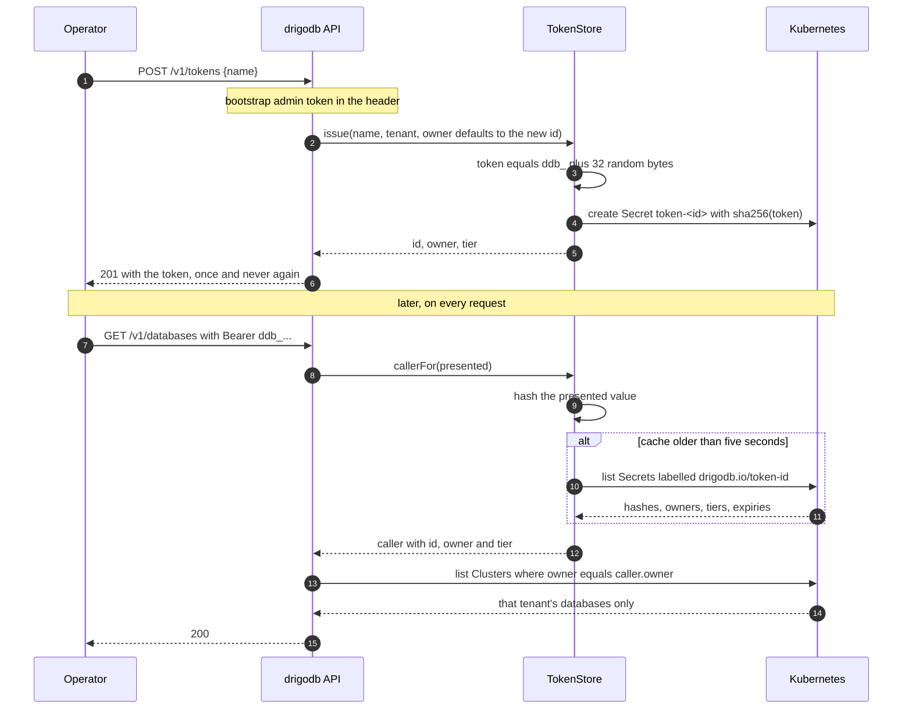
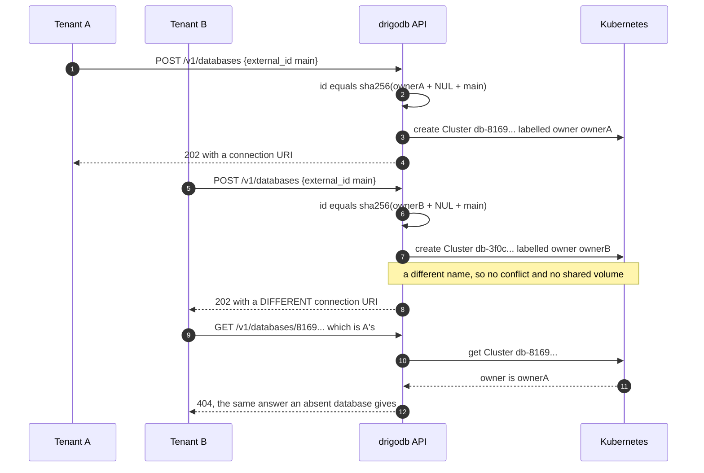
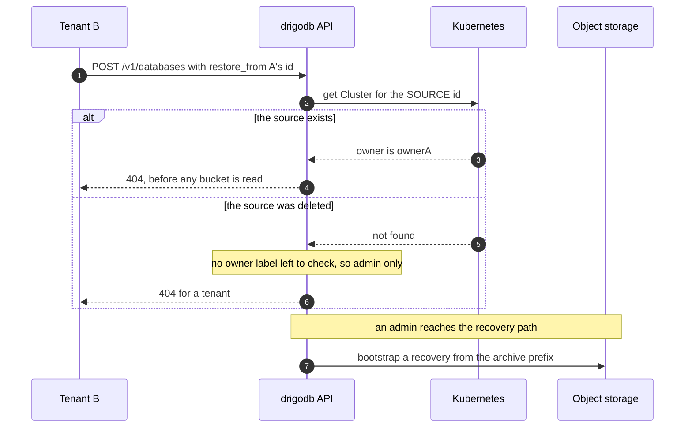

# Who can reach what

Three drawings of decision [0009](../decisions/0009-one-tenant-cannot-reach-another.md).
The first is a token becoming a credential, the second is the case the whole design
exists for, and the third is the one that reads data rather than metadata.

## A token is issued, and then used

The raw token exists in one response and nowhere else. What is stored is a hash, so
drigodb could not show it to you twice if it wanted to.

## Two tenants, both calling it `main`

The id is derived from the owner as well as the `external_id`, so the Cluster names
differ and the lock that makes `create` idempotent still holds for each of them
separately.

Before this the second `POST` derived the **same** id, found A's Cluster, took the
idempotent path, and returned A's database with A's connection URI.

## Restoring from a database, which reads its data

`restore_from` is the sharpest of these and is not in #72's table. A restored database is
a full copy, and the only pre-existing guard checked that a named backup belonged to the
named source rather than that the caller could reach it.

An admin's id is `sha256(external_id)` alone, so a name like `openvoid-app-01JQ` is a
guess rather than a search. That is why this check is in front of the bucket read rather
than beside it.
