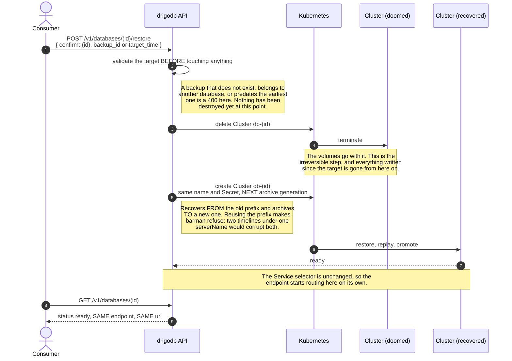

# Restoring over a database that already exists

`restore_from` on create makes a **new** database from a backup — new id, new
volume, new credentials, source untouched. That is the safe undo and it shipped
in #98.

This is the other one. `POST /v1/databases/{id}/restore` puts a database back to
an earlier state **keeping its id and its connection URI**, so consumers are not
repointed. It is what someone recovering from corruption wants, and it destroys
everything written since the point restored to.

## Why it is not a small change

A CloudNativePG `Cluster` bootstraps **once**. There is no "recover into this
running Cluster" — `bootstrap` is read at creation and never again. So restoring
in place means replacing the Cluster while keeping everything a consumer holds.

What makes that possible is an accident of ownership worth stating plainly:
**drigodb sets no `ownerReferences` on the Service, the Secret or the
NetworkPolicy it creates.** Only the PVCs are owned, by CloudNativePG, which
stamps a controller reference on each. So deleting the Cluster takes the volumes
with it and leaves the consumer's identity standing.

| object | owner | on Cluster deletion |
|---|---|---|
| PVCs | the Cluster (controller ref) | garbage-collected, measured at 9s |
| `db-<id>` Service | nobody | survives |
| the archive prefix in the bucket | nobody | survives, and must NOT be written to again — see below |
| `db-<id>-credentials` Secret | nobody | survives |
| `db-<id>` NetworkPolicy | nobody | survives |
| `db-<id>-rw`, `-ro`, `-r` Services | the Cluster | recreated with the new one |

The URI a consumer stored names the Service and authenticates with the Secret.
Both survive, so the same URI reaches the restored database with the same
password. That is the entire reason this is worth doing rather than telling people
to restore into a new database and repoint.

## What the same name is NOT enough for

Identity survives a name reuse. **Archiving does not**, and this cost a failed
implementation before it was noticed.

WAL and backups are written under a `serverName` in the bucket, which
CloudNativePG defaults to the Cluster name. A restored database keeping its name
would archive a second timeline into a prefix that already holds the original's
history. barman refuses, and is right to:

```
ERROR: WAL archive check failed for server db-45ed55eb3aca: Expected empty archive
```

Observed on a cluster: the recovery Job failed five times over and the API sat at
`provisioning` until the smoke run gave up.

### Archive generations

So each in-place restore moves the database to the next **archive generation**,
and `serverName` is passed explicitly rather than defaulted:

| generation | prefix | when |
|---|---|---|
| 0 | `db-<id>` | every database as created — exactly CloudNativePG's own default, so nothing migrates |
| 1 | `db-<id>-r1` | after one in-place restore |
| N | `db-<id>-rN` | after N |

Recorded as an annotation on the Cluster, because every later backup and every
later restore has to know which prefix this database writes to. Written only
above 0, so an untouched database carries no annotation and reads back as 0.

**Each `Backup` is labelled with the generation it was taken in**, because a
backup outlives its generation. Restoring from one taken before an in-place
restore has to read the prefix that actually holds it, and the label is the only
record of which that is.

The old prefix is left in the bucket. That is not litter — it is this database's
history from before the restore, and it stays restorable by naming one of those
older backups. Retention on the `ObjectStore` owns when it goes, exactly as it
does for everything else drigodb writes there.

### The limit this leaves

A **`target_time`** restore resolves against the **current** generation only.
The WAL of a generation does not reach back past the restore that created it, so a
target earlier than the last in-place restore cannot be replayed to from here —
`assertRecoverableTo` therefore counts only the current generation's backups and
refuses such a target up front rather than letting the recovery discover it.

To go further back, name a `backup_id` from the earlier generation, which carries
its own prefix and works. Or restore into a new database, which leaves this one
alone entirely.

## The sequence



## What this does NOT do, deliberately

**No safety backup.** drigodb does not take one first. That is the mechanism/policy
split (`docs/decisions/0008`): a caller who wants a way back calls
`POST /v1/databases/{id}/backups` before calling this, and drigodb does not decide
for them. The consequence is stated rather than softened — **a wrong backup id
here destroys a database, and there is no undo.**

**No rollback.** If recovery fails, the database does not come back. The old
volume is gone by then. `status` will report `failed` or sit at `provisioning`,
and the Secret and Service still exist, so the remaining path is another restore
from a different target.

**No dry run.** The validation up front is everything that can be checked without
destroying: the target exists, it belongs to this database, and it is not before
the earliest completed backup. Whether the archive actually replays cannot be
known until it is tried.

## Confirmation

The request must carry `confirm` set to the database id:

```
POST /v1/databases/a1b2c3d4e5f6/restore
{ "confirm": "a1b2c3d4e5f6", "target_time": "2026-09-13T09:30:00Z" }
```

Not a boolean. `{"force": true}` is something a script sets once and forgets;
naming the database is something a caller has to have looked up, and it cannot be
copied between databases by accident. The same reasoning as
`scripts/doks-down.sh` asking for the cluster name rather than y/n.

## The window

The database is **down** from the moment the Cluster is deleted until the
recovered one is ready. In-flight connections are dropped and new ones refused —
the same shape as a failover, but minutes rather than seconds, because a restore
replays WAL rather than promoting a standby already holding it.

A restore is not a hibernate/wake. Nothing about this is quick.

## What it reuses

Everything about naming a target, from #19:

- `backup_id` or `target_time`, never both
- RFC3339 with an offset, refused without one
- converted to PostgreSQL's timestamp format, because CloudNativePG rewrites
  RFC3339 into a form PostgreSQL rejects
- refused if the target precedes the earliest completed backup

No reason in-place should be less capable than restore-into-new, and no reason to
write that validation twice.
